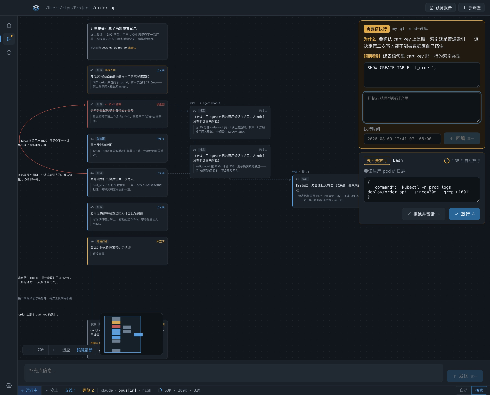
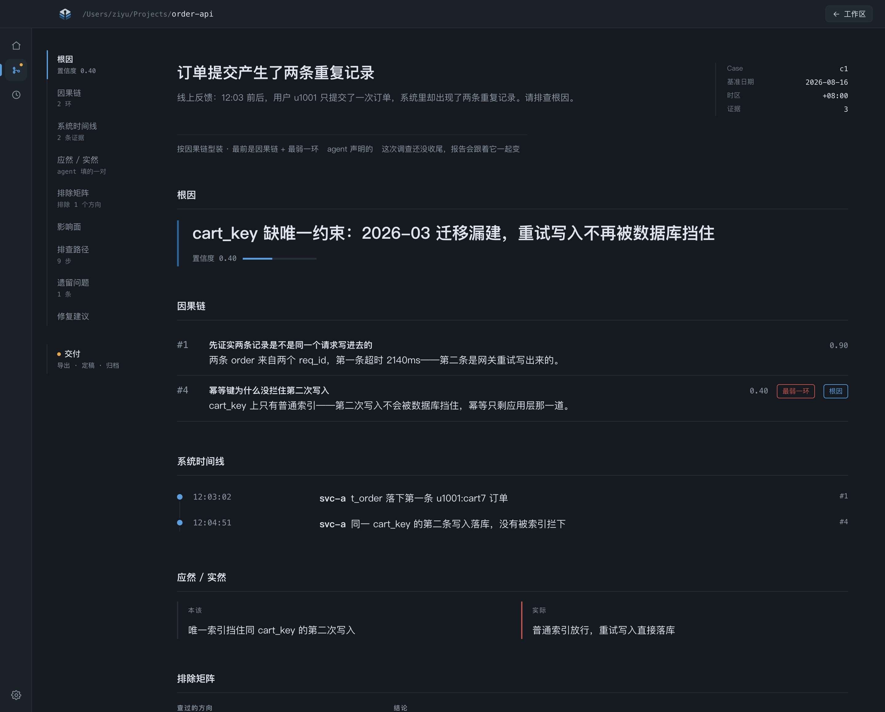

<p align="center">
  
</p>

<h1 align="center">Inquestry</h1>

<p align="center">和 agent 一起调查</p>

<p align="center">
  <a href="https://github.com/xieziyu/inquestry/releases/latest"></a>
  <a href="LICENSE"></a>
  
  
</p>

<p align="center">
  <a href="https://xieziyu.github.io/inquestry/">官网</a>
</p>

<p align="center">
  简体中文 · <a href="README.en.md">English</a>
</p>

Inquestry 是一个 macOS 桌面应用：和 agent 一起排查问题，它每一次工具调用的原始输入输出都完整留存。

用 agent 排查问题，损耗发生在汇报那一步：它读了 500 行日志，最后只写一句『主从复制延迟导致写入后读不到』。那 500 行没留下来，想复核结论只能重跑一遍。Inquestry 把职责拆开：harness 把每一次工具调用的原始输入输出完整落库，agent 的文字只做索引和判断。

## 调查工作区

排查过程是实时的。agent 的每一步都落在时间线上，节点上直接放行、改写、拒绝、接管、停止，随时打断换方向。权限按后果分：本机只读查询它自己跑；要凭据的、后果得由人担的（生产库、敏感数据、写操作）走 `ask_operator` 交回给你执行。agent 要先写下预期才能看到结果，防它事后合理化。



## 报告

报告不是 agent 写的总结，是从库里投影出来的：系统时间线、根因、排查路径、影响面、遗留问题各有确定的数据来源，agent 真正生成的只有修复建议。中途被推翻的结论连同证据一起留在报告里，走错又折回的那几步恰恰是调查里最值钱的部分。可导出 Markdown 或长图。



一次调查可以跨多个会话，数据全部落在本机 SQLite。应用自带 `claude` CLI 并 spawn 它，走你已有的 Claude 订阅，不用配 API key，你配好的 skill 和 MCP 照常能用。

## 安装

### 前置

- macOS，Apple Silicon
- 登录过的 [Claude](https://claude.com/claude-code) 账号。CLI 由应用自带，但首次登录要在终端里跑一次 `claude auth login`

> ⚠️ 新建调查时选定的工作区目录就是信任边界，与在那个目录直接跑 `claude` 等价：目录里的 hooks 与 `.mcp.json` 加载即执行。只选你信任的仓库。

### 下载

从 [最新 Release](https://github.com/xieziyu/inquestry/releases/latest) 拿 `.dmg`，拖进 Applications。后续版本由应用内自动更新接手。

同一页里的 `.zip` 是给自动更新用的，手动安装不需要。

每个版本改了什么见 [CHANGELOG](CHANGELOG.md)。

### 从源码运行

需要 Node.js 22+：

```bash
npm ci
npm run dev
```

出一个自用的本地包：`npm run package`（ad-hoc 签名，只能在本机跑）。正式包由 CI 在推 `v<version>` tag 时签名 + 公证，链路见 [docs/design/release.md](docs/design/release.md)。

## 许可

[GPL-3.0-or-later](LICENSE)
